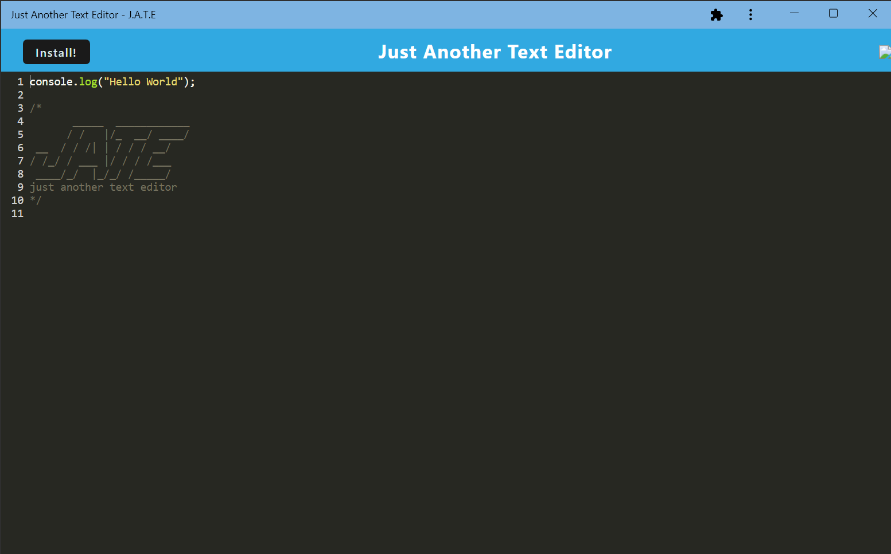
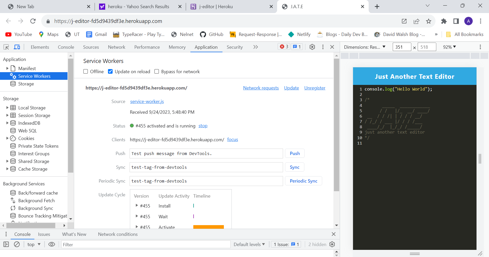
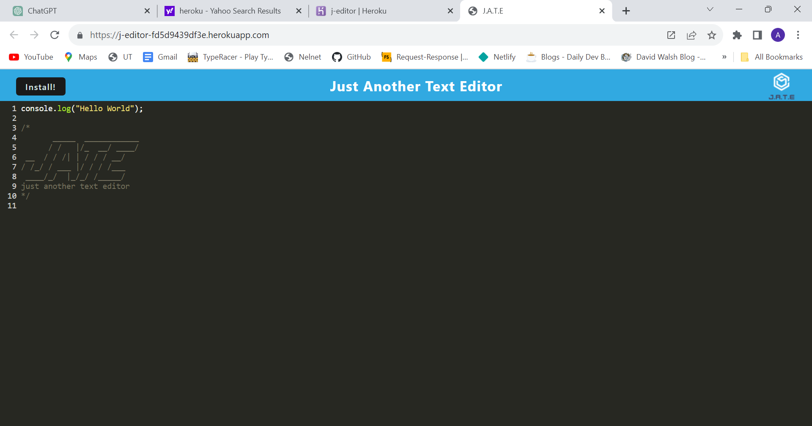
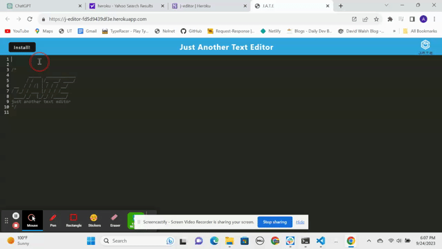

  

# Client-First

## Description
Text Editor named J.A.T.E. for writing code

## Table of Contents
- [Installation](#Installation)
- [Usage](#Usage)
- [Credits](#Credits)
- [License](#License)
- [Contributors](#Contributing)
- [Tests](#Tests)
- [Questions](#Questions)

## Installation
Please install node.js 
  
## Usage 
This app will allow the user write code and save it even when offline

## Credits
Source code is from github https://github.com/coding-boot-camp/cautious-meme. We did a significant portion of the homework during class time, most if not all of the code in Index.js, src-sw.js, webpack.config.js and database.js are from class examples as well as Eli, the instructor. The code logic in install.js was borrowed from Eric Beverly from class, his github is https://github.com/esbev

## License 
For more info, please visit: [License Link](https://opensource.org/licenses/MIT)

## Contributing
Feel free to help with registering the service worker

## Tests 
No tests included currently

## Questions 
If you have any questions you can find me at [SilvAG6271](https://github.com/SilvAG6271) and <a href="mailto:auron7985@gmail.com">auron7985@gmail.com</a>.
